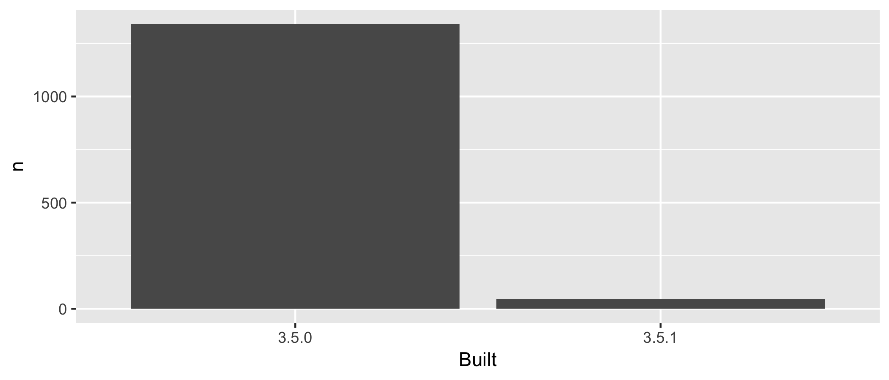

HELLO FROM GITHUB


<!-- README.md is generated from README.Rmd. Please edit that file -->

```{r setup, include = FALSE}
knitr::opts_chunk$set(
  collapse = TRUE,
  comment = "#>"
)
library(tidyverse)
```

# explore-libraries

## Overview

The goal of packages-report is to explore the packages in my R installation.

```{r, include = FALSE}
freqtable_file <- fs::dir_ls(here::here("data"), glob = "*freqtable.csv")
apt_freqtable <- readr::read_csv(freqtable_file)
```

I have `r sum(apt_freqtable$n)` add-on packages installed.

Here's how they break down in terms of which version of R they were built under, which is related to how recently they were updated on CRAN.

```{r, echo = FALSE}
apt_freqtable %>% 
  mutate(prop = round(prop, 2)) %>% 
  knitr::kable()
```



### Flow of the analysis

| Input                         | Script                        | Output                                            |
|-------------------------------|-------------------------------|---------------------------------------------------|
|                               | [R/01_write-installed-packages.R](R/01_write-installed-packages.R) | [data/installed-packages.csv](data/installed-packages.csv)                            |
| [data/installed-packages.csv](data/installed-packages.csv)        | [R/02_wrangle-packages.R](R/02_wrangle-packages.R)         | [data/add-on-packages.csv](data/add-on-packages.csv)<br>[data/add-on-packages-freqtable.csv](data/add-on-packages-freqtable.csv) |
| [data/add-on-packages-freqtable.csv](data/add-on-packages-freqtable.csv) | [R/03_barchart-packages-built.R](R/03_barchart-packages-built.R)  | [figs/built-barchart.png](figs/built-barchart.png)                                |
